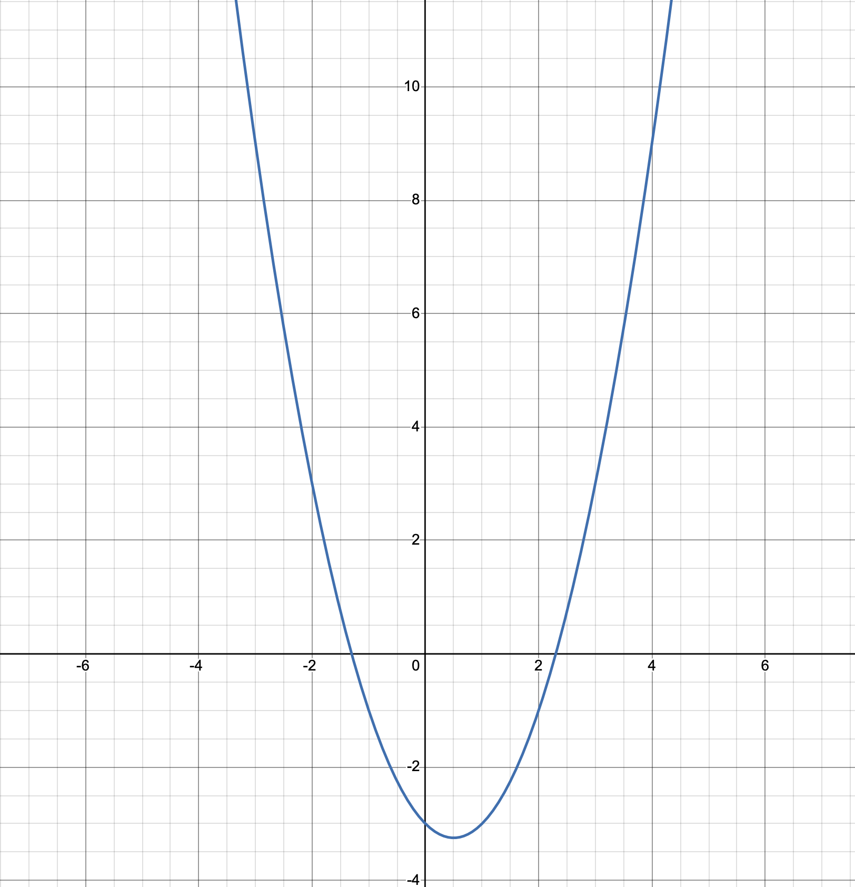
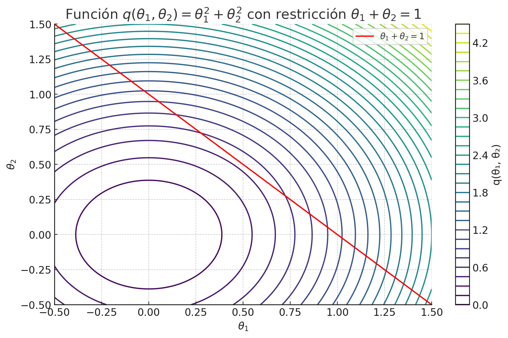

## Ejercicio 1. Solución analítica

Encuentra el mínimo de $f(\theta) = -(1 - \theta^2) - (2 + \theta)$. 



**Solución**

Vamos a simplificarla:

```math
f(\theta) = -(1 - \theta^2) - (2 + \theta) = -1 + \theta^2 - 2 - \theta = \theta^2 - \theta - 3
```

Ahora que tenemos la función simplificada $f(\theta) = \theta^2 - \theta - 3$, podemos encontrar su mínimo derivando la función y resolviendo $f'(\theta) = 0$.

#### Derivada de $f(\theta)$

```math
f'(\theta) = \frac{d}{d\theta}(\theta^2 - \theta - 3) = 2\theta - 1
```

#### Igualar a cero
Igualamos la derivada a cero para encontrar los puntos críticos:

```math
2\theta - 1 = 0
```

```math
\theta = \frac{1}{2}
```

#### **Extra** Comprobar que es un mínimo
Calculamos la segunda derivada de $f(\theta)$ para determinar si este punto es un máximo o mínimo:

```math
f''(\theta) = \frac{d}{d\theta}(2\theta - 1) = 2
```

Dado que la segunda derivada es positiva ($f''(\theta) = 2$), esto indica que la función tiene un **mínimo** en $\theta = \frac{1}{2}$.

## Ejercicio 2. Optimización con restricciones

Sea $f(\theta_1,\theta_2)=\theta_1^2+\theta_2^2$ se pide encontrar el mínimo para $\theta_1+\theta_2\geq 1$





Obtenemos el lagrangiano:

```math
\mathcal{L}(\theta_1, \theta_2, \alpha) = \theta_1^2 + \theta_2^2 - \alpha(\theta_1 + \theta_2 -1)
```

Derivamos con respecto a $\theta_1,\theta_2$e igualamos a cero:

```math
\frac{\partial \mathcal{L}}{\partial \theta_1} = 2\theta_1 - \alpha = 0; ~~~~~~\theta_1=\frac{\alpha}{2}
```

```math
\frac{\partial \mathcal{L}}{\partial \theta_2} = 2\theta_2 - \alpha = 0 ;~~~~~~ \theta_2=\frac{\alpha}{2}
```

Teorema KT, sustituimos en la expresión $\alpha v(\theta)$los valores optimos de $\theta$:

```math
\alpha v(\theta_1,\theta_2)=0
```

```math
\alpha(\frac{\alpha}{2}+\frac{\alpha}{2}-1)=0
```

```math
\alpha(\alpha-1)=0 \rightarrow {\alpha=0~~~~ ó~~~~ \alpha=1}
```

La primera solución $\alpha=0$ viola la condición que $\theta_1+\theta_2\geq 1$ dado que llevaría a $\theta_1=0$ y $\theta_2=0$ por lo tanto la descartamos. 

La segunda solución sería correcta dado que llevaría a $\theta_1=\frac{1}{2}$ y $\theta_2=\frac{1}{2}$ que sí cumplen con la restricción.


## Ejercicio 3

Sea una regresión lineal $y=wx+b$, donde $x,y\in\R^1$. Tenemos las siguientes muestras de entrenamiento $S=\{(x_1,y_1)\ldots(x_n,y_n)\}$:

$S=\{(1,1),(2,1),(4,2)\}$

Teniendo en cuenta que queremos realizar una optimización de los parámetros mediante descenso por gradiente bajo los siguientes supuestos:


* Emplearemos notación compacta, $y=\mathbf{w}^T\mathbf{x}$
* Inicializaremos $\mathbf{w}=0$
* la función de pérdida es $J(\mathbf{w})=\sum_{i=1}^n(y_i-(\mathbf{w}^T\mathbf{x_i}))^2$
* La constante de aprendizaje $\alpha=0.01$


Se pide realizar una primera iteración de descenso por gradiente.

**Solución**

Dada la regresión lineal:

$$
y = \mathbf{w}^T \mathbf{x}
$$

donde \( \mathbf{w} \) incluye tanto el peso como el sesgo, y \( \mathbf{x} \) es un vector que incluye el valor de \( x \) y una constante 1:

$$
\mathbf{w} = \begin{bmatrix} w \\ b \end{bmatrix}, \quad \mathbf{x_i} = \begin{bmatrix} x_i \\ 1 \end{bmatrix}
$$

Para el conjunto de entrenamiento:

$$
S = \{(1,1), (2,1), (4,2)\}
$$

tenemos los siguientes puntos:

$$
\mathbf{x_1} = \begin{bmatrix} 1 \\ 1 \end{bmatrix}, y_1 = 1 
$$

$$
\mathbf{x_2} = \begin{bmatrix} 2 \\ 1 \end{bmatrix}, y_2 = 1 
$$

$$
\mathbf{x_3} = \begin{bmatrix} 4 \\ 1 \end{bmatrix}, y_3 = 2
$$

#### Función de Pérdida

La función de pérdida se define como:

$$
J(\mathbf{w}) = \sum_{i=1}^n (y_i - \mathbf{w}^T \mathbf{x_i})^2
$$

Sustituyendo los puntos del conjunto \( S \):

$$
J(\mathbf{w}) = (1 - \mathbf{w}^T \mathbf{x_1})^2 + (1 - \mathbf{w}^T \mathbf{x_2})^2 + (2 - \mathbf{w}^T \mathbf{x_3})^2
$$

#### Inicialización

Inicializamos los parámetros:

$$
\mathbf{w} = \begin{bmatrix} 0 \\ 0 \end{bmatrix}
$$

#### Gradiente de la Función de Pérdida

Para calcular el gradiente, utilizamos:

$$
\frac{\partial J}{\partial \mathbf{w}} = -2 \sum_{i=1}^n (y_i - \mathbf{w}^T \mathbf{x_i}) \mathbf{x_i}
$$

Calculamos cada término:

1. **Para \( i=1 \)**:

$$
y_1 - \mathbf{w}^T \mathbf{x_1} = 1 - (0 \cdot 1 + 0 \cdot 1) = 1
$$

2. **Para \( i=2 \)**:

$$
y_2 - \mathbf{w}^T \mathbf{x_2} = 1 - (0 \cdot 2 + 0 \cdot 1) = 1
$$

3. **Para \( i=3 \)**:

$$
y_3 - \mathbf{w}^T \mathbf{x_3} = 2 - (0 \cdot 4 + 0 \cdot 1) = 2
$$

Sustituyendo en el gradiente:

$$
\frac{\partial J}{\partial \mathbf{w}} = -2 \left( 1 \begin{bmatrix} 1 \\ 1 \end{bmatrix} + 1 \begin{bmatrix} 2 \\ 1 \end{bmatrix} + 2 \begin{bmatrix} 4 \\ 1 \end{bmatrix} \right)
$$

Calculando el sumatorio:

$$
-2 \begin{bmatrix} 11 \\ 4 \end{bmatrix} = \begin{bmatrix} -22 \\ -8 \end{bmatrix}
$$

#### Actualización de Parámetros

Con una tasa de aprendizaje \( \alpha \):

$$
\mathbf{w}_{t+1} = \mathbf{w}_{t} - \alpha \frac{\partial J}{\partial \mathbf{w}}
$$

Asumiendo \( \alpha = 0.01 \):

$$
\mathbf{w}_{t+1} = \begin{bmatrix} 0 \\ 0 \end{bmatrix} - 0.01 \begin{bmatrix} -22 \\ -8 \end{bmatrix} = \begin{bmatrix} 0.22 \\ 0.08 \end{bmatrix}
$$

#### Resultado Final

Después de la primera iteración de descenso por gradiente, los nuevos parámetros son:

$$
\mathbf{w}_{t+1} = \begin{bmatrix} 0.22 \\ 0.08 \end{bmatrix}
$$

## Ejercicio 4

Resuelve el mismo ejercicio anterior pero asumiendo un término regularizador $\lambda=0.1$

