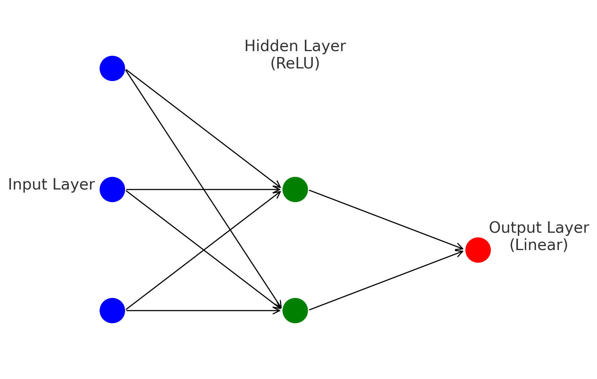

## Ejercicio

MLP con una capa oculta, la función de activación de la capa oculta es ReLU, la de la capa de salida es lineal. 



La función de coste es la divergencia al cuadrado:

```math
J(\mathbf{W}) = \frac{1}{2} \| \hat{\mathbf{y}} - \mathbf{y} \|^2
```


 Se utilizan los siguientes valores:

### Valores:
- **Entrada**: $\mathbf{x} = [-1, 0, 2]$
- **Salida esperada**: $\mathbf{y} = [3]$
- **Pesos de la capa 1**:

```math
W^{~1}= \begin{pmatrix} 2 & 0 & 1 \\ 0 & -1 & 1 \end{pmatrix}
```

- **Pesos de la capa 2**:

```math
W^2 = \begin{pmatrix} -1 \\ 1 \end{pmatrix}
```

### Funciones de activación:
- **ReLU para la capa oculta**:

```math
f(z) = \max(0, z)
```

- **Función lineal para la capa de salida** (sin función de activación, simplemente $f(z) = z$).

---

### Forward Propagation

#### Cálculo de las activaciones en la capa oculta:

```math
z^1 = W^1 \cdot x = \begin{pmatrix} 2 & 0 & 1 \\ 0 & -1 & 1 \end{pmatrix} \cdot \begin{pmatrix} -1 \\ 0 \\ 2 \end{pmatrix} = \begin{pmatrix} 0 \\ 2 \end{pmatrix}
```
Luego, aplicamos la función de activación ReLU:

```math
a^1 = \text{ReLU}(z^1) = \begin{pmatrix} 0 \\ 2 \end{pmatrix}
```

#### Cálculo de la salida de la red (capa de salida):

```math
z^2 = W^2 \cdot a^1 = \begin{pmatrix} -1 & 1 \end{pmatrix} \cdot \begin{pmatrix} 0 \\ 2 \end{pmatrix} = 2
```

Dado que la función de activación en la capa de salida es lineal, tenemos:

```math
a^2 = z^2 = 2
```

#### Error:

```math
\text{Error} = a^2 - y = 2 - 3 = -1
```

---

### Backward Propagation

#### Cálculo del gradiente en la capa de salida:

```math
\delta^2 = \text{Error} = -1
```

El gradiente de los pesos de la capa de salida $W^2$ es:

```math
\text{gradiente de } W^2 = a^1 \cdot \delta^{2} = \begin{pmatrix} 0 \\ 2 \end{pmatrix} \cdot (-1) = \begin{pmatrix} 0 \\ -2 \end{pmatrix}
```

#### Cálculo del gradiente en la capa oculta:

```math
\delta^1 = (W^2 \cdot \delta^2) \odot f'(z^1)
```

Primero:

```math
W^2 \cdot \delta^2 = \begin{pmatrix} -1 \\ 1 \end{pmatrix} \cdot (-1) = \begin{pmatrix} 1 \\ -1 \end{pmatrix}
```

Luego, multiplicamos por la derivada de ReLU (suponemos que la derivada en 0 es 0):

```math
f'(z^1) = \begin{pmatrix} 0 \\ 1 \end{pmatrix}
```

```math
\delta^1 = \begin{pmatrix} 1 \\ -1 \end{pmatrix} \odot \begin{pmatrix} 0 \\ 1 \end{pmatrix} = \begin{pmatrix} 0 \\ -1 \end{pmatrix}
```

El gradiente de los pesos de la primera capa $W^1$ es:

```math
\text{gradiente de } W^1 = \delta^1 \cdot x^T = \begin{pmatrix} 0 \\ -1 \end{pmatrix} \cdot \begin{pmatrix} -1 & 0 & 2 \end{pmatrix} = \begin{pmatrix} 0 & 0 & 0 \\ 1 & 0 & -2 \end{pmatrix}
```


