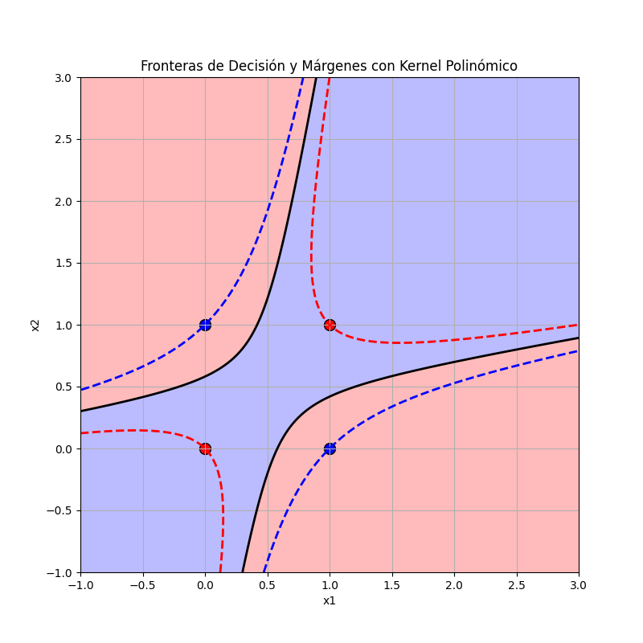

# Ejercicio SVM con funciones Kernels


Dado el siguiente conjunto de datos y un Kernel polinómico definido como 

```math

K(x, y) = (\langle x, y \rangle + 1)^2 

```


### Muestras: 

$( x_1 = [1, 1], c_1 = +1)$

$( x_2 = [0, 0], c_2 = +1)$

$( x_3 = [0, 1], c_3 = -1)$

$( x_4 = [1, 0], c_4 = -1)$


## Calcula la matriz Kernel para dichas muestras

### Matriz Kernel

La matriz Kernel $K$ es calculada como:

```math

K_{ij} = K(x_i, x_j) = (\langle x_i, x_j \rangle + 1)^2.

```


Para los datos proporcionados:

```math

K =

\begin{bmatrix}

9 & 1 & 4 & 4 \\

1 & 1 & 1 & 1 \\

4 & 1 & 4 & 1 \\

4 & 1 & 1 & 4

\end{bmatrix}

```


## Resuelvemos el problema de optimización para este conjunto

Resolvemos el problema de optimiación con márgenes duros (no hay C): [código](assets/optim.py)

```python
from scipy.optimize import minimize
import numpy as np

# Datos y etiquetas
x = np.array([[1, 1], [0, 0], [0, 1], [1, 0]])
labels = np.array([1, 1, -1, -1])
n_samples = len(labels)

# Definición del kernel polinómico
def polynomial_kernel(x, y):
    return (np.dot(x, y) + 1) ** 2


# Construcción de la matriz kernel
kernel_matrix = np.zeros((4, 4))
for i in range(4):
    for j in range(4):
        kernel_matrix[i, j] = polynomial_kernel(x[i], x[j])


# Definir la función objetivo para la optimización dual de SVM
def objective(alphas):
    return 0.5 * np.sum([alphas[i] * alphas[j] * labels[i] * labels[j] * kernel_matrix[i, j] for i in range(n_samples) for j in range(n_samples)]) - np.sum(alphas)

# Restricción: \sum \alpha_i y_i = 0
def constraint_eq(alphas):
    return np.dot(alphas, labels)

# Restricción: \alpha_i >= 0
bounds = [(0, None) for _ in range(n_samples)]

# Punto inicial para la optimización
initial_alphas = np.zeros(n_samples)

# Resolver el problema de optimización
result = minimize(
    fun=objective,
    x0=initial_alphas,
    bounds=bounds,
    constraints={'type': 'eq', 'fun': constraint_eq},
    method='SLSQP'
)

# Extraer los valores de \alpha
optimal_alphas = result.x

print(optimal_alphas)
```

Obtenemos los siguientes valores de $\alpha$:


```math

\alpha_1 = 2.0, \quad \alpha_2 = 10/3, \quad \alpha_3 = 8/3, \quad \alpha_4 = 8/3

```

**Nota** También se podría resolver con márgenes blandos ver [Optimización márgenes blandos](assets/optimC.py)

## Fronteras de decisión



## Clasifica las muestras de entrenamiento

Para cada $x_i$, la función discriminante es:

```math

f(x_i) = \sum_{n=1}^4 c_n \alpha_n K(x_n, x_i) + b,

```

donde $b$ (bias) se calcula como:

```math

b = c_n - \sum_{m=1}^4 c_m \alpha_m K(x_n, x_m), ~~~~~~~~~~~~\text{para }\alpha_n>0

```


#### Calcular el bias

Por ejemplo para $(x_1 = [1, 1], c_1 = +1)$:

```math

  b= +1 - \sum_{m=1}^4 c_m \alpha_m K(x_1, x_m) = +1-(2*9 + 1*(10/3) - 4*(8/3) - 4*(8/3)) = 1 - (54/3 + 10/3 - 32/3 -32/3)=1-0=1

```

Por lo tanto $b=1$

(comprobad que sale b=1 para cualquier $x_n$ elegido)


#### Verificar Clasificación


Para cada muestra $x_i$:

```math

f(x_i) = \sum_{n=1}^4 c_n \alpha_n K(x_n, x_i) + b

```


#### Cálculos:


**Para \( x_1 \):**

```math
\begin{array}{l}
f(x_1) = (2*9 + 1*10/3 - 4*8/3 - 4*8/3)+ 1.0 = (54/3+10/3−32/3−32/3)+1.0=+1.0 \Rightarrow~~~~~~~~~~~\\
\Rightarrow \text{sign}(f(x_1)) = +1 = c_1\Rightarrow OK
\end{array}
```


**Para \( x_2 \):**

```math
\begin{array}{l}
f(x_2) = (2*1 + 10/3*1 - 8/3*1 - 8/3*1) + 1.0 = (6/3+10/3-8/3-8/3)+1=+1 \Rightarrow~~~~~~~~~~~~~~~~~~~~~~~\\
 \Rightarrow \text{sign}(f(x_2)) = +1 = c_2\Rightarrow OK
\end{array}
```


**Para \( x_3 \):**

```math
\begin{array}{l}
f(x_3) = (2*4 + 1*10/3 - 4*8/3 - 1*8/3) + 1.0 = (24/3+10/3-32/3-8/3)+1.0=-2+1=-1 \Rightarrow\\ 
\Rightarrow \text{sign}(f(x_3)) = -1 = c_3\Rightarrow OK
 \end{array}
```


**Para \( x_4 \):**

```math
\begin{array}{l}
f(x_4) = (2*4 + 1*10/3 - 1*8/3 - 4*8/3) + 1.0 = (24/3+10/3-8/3-32/3)+1.0=-2+1=-1 \Rightarrow\\
\Rightarrow \quad \text{sign}(f(x_4)) = -1 = c_4\Rightarrow OK
 \end{array}

```

---

Efectivamente todas las muestras de entrenamiento se clasifican correctamente y con: $c_nf(x)\geq 1$. En concreto para las 4 muestras de entrenamiento $c_nf(x)=1$, por lo tanto se encuentran en el margen como se puede ver en la figura de arriba.

